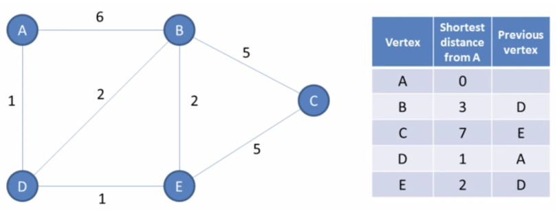

# Graph

## A* algorithm

Complete solution to find the shortest path to a target node

Algorithm:
- Put initial state in a priority queue
- While priority queue is not empty: poll an element and inserts all neighbours
- If target is reached, update a min variable

Priority is computed using the evaluation function: f(n) = h + g where h is an heuristic (local cost to visit a node) and g is the cost so far (length of the path so far)

[#graph](graph.md)

## Backedge definition

An edge from a node to itself or to an ancestor

[#graph](graph.md)

## Best-first search algorithm

Greedy solution (non-complete) to find the shortest path to a target node

Algorithm:
- Put initial state in a priority queue
- While target not reached: poll an element and inserts all neighbours

Priority is computed using the evaluation function: f(n) = h where h is an heuristic (local cost to visit a node)

[#graph](graph.md) [#greedy](greedy.md)

## BFS & DFS graph traversal use cases

BFS: shortest path

DFS: does a path exist, does a cycle exist (memo: D for Does)

DFS stores a single path at a time, requires less memory than BFS (on average but same space complexity)

[#graph](graph.md)

## BFS and DFS graph traversal time and space complexity

Time: O(v + e) with v the number of vertices and e the number of edges

Space: O(v)

[#complexity](complexity.md) [#graph](graph.md)

## Bidirectional search

Run two simultaneous BFS, one from the source, one from the target

Once their searches collide, we found a path

If branching factor of a tree is b and the distance to the target vertex is d, then the normal BFS/DFS searching time complexity would we O(b^d)

Here it is O(b^(d/2))

[#graph](graph.md)

## Connected graph definition

If there is a path between every pair of vertices, the graph is called connected

Otherwise, the graph consists of multiple isolated subgraphs

[#graph](graph.md)

## Difference Best-first search and A* algorithms

Best-first search is a greedy solution: not complete // a solution can be not optimal

A*: complete

[#graph](graph.md)

## Dijkstra algorithm

Input: graph, initial vertex

Output: for each vertex: shortest path and previous node // The previous node is the one we are coming from in the shortest path. To find the shortest path between two nodes, we need to iterate backwards.  Example: A -> C => E, D, A



Algorithm:
- Init the shortest distance to MAX except for the initial node
- Init a priority queue where the comparator will be on the total distance so far
- Init a set to store all visited node
- Add initial vertex to the priority queue
- While queue is not empty: Poll a vertex (mark it visited) and check the total distance to each neighbour (current distance + distance so far), update shortest and previous arrays if smaller. If destination was unvisited, adds it to the queue

```java
void dijkstra(GraphAjdacencyMatrix graph, int initial) {
	Set<Integer> visited = new HashSet<>();

	int n = graph.vertex;
	int[] shortest = new int[n];
	int[] previous = new int[n];
	for (int i = 0; i < n; i++) {
		if (i != initial) {
			shortest[i] = Integer.MAX_VALUE;
		}
	}

	// Entry: key=vertex, value=distance so far
	PriorityQueue<Entry> minHeap = new PriorityQueue<>((e1, e2) -> e1.value - e2.value);
	minHeap.add(new Entry(initial, 0));

	while (!minHeap.isEmpty()) {
		Entry current = minHeap.poll();
		int source = current.key;
		int distanceSoFar = current.value;

		// Get neighbours
		List<GraphAjdacencyMatrix.Edge> edges = graph.getEdge(source);
		
		for (GraphAjdacencyMatrix.Edge edge : edges) {
			// For each neighbour, check the total distance
			int distance = distanceSoFar + edge.distance;
			if (distance < shortest[edge.destination]) {
				shortest[edge.destination] = distance;
				previous[edge.destination] = source;
			}

			// Add the element in the queue if not visited
			if (!visited.contains(edge.destination)) {
				minHeap.add(new Entry(edge.destination, distance));
			}
		}

		visited.add(source);
	}

	print(shortest);
	print(previous);
}
```

[#graph](graph.md)

## Dynamic connectivity problem

Given a set of nodes and edges: are two nodes connected (directly or in-directly)?

Two methods:
- union(2, 5) // connect object 2 with object 5
- connected(1 , 6) // is object 1 connected to object 6?

### Further Reading

- [Dynamic Connectivity Problem](https://medium.com/omarelgabrys-blog/dynamic-connectivity-problem-9460f3dff2c6) by Omar El Gabry

[#graph](graph.md)

## Dynamic connectivity problem - Quick-find solution

Array of integer of size N initialized with their index (0: 0, 1: 1 etc.).

If two indexes have the same value, they belong to the same group.

- Is connected: id[p] == id[q] // O(1)
- Union: change all elements in the array whose value is equals to id[q] and set them to id[p] // O(n)

[#graph](graph.md)

## Dynamic connectivity problem - Quick-union solution

Init: integer array of size N

Interpretation: id[i] is parent of i, root parent if id[i] == i

- Is connected: check if p and q have the same parent // O(n)
- Union: set the id of p's root to the id of q's root // O(n)

[#graph](graph.md)

## Dynamic connectivity problem - Weighted Quick-union solution

Modify quick-union to avoid tall tree

Keep track of the size of each tree (number of nodes): extra array size[i] to count number of objects in the tree rooted at i

O(n) extra space

- Union: link root of smaller tree to root of larger tree // O(log(n))
- Is connected: root(p) == root(q) // O(log(n))

[#graph](graph.md)

## Given n tasks from 0 to n-1 and a list of relations so that a -> b means a must be scheduled before b, how to know if it is possible to schedule all the tasks (no cycle)

Solution: topological sort

If there's a cycle in the relations, it means it is not possible to shedule all the tasks

There is a cycle if the produced sorted array size is different from n

[#graph](graph.md)

## Graph definition

A way to represent a network, or a collection of inteconnected objects

G = (V, E) with V a set of vertices (or nodes) and E a set of edges (or links)

[#graph](graph.md)

## Graph traversal: BFS

Traverse broad into the graph by visiting the sibling/neighbor before children nodes (one level of children at a time)

Iterative using a queue

Algorithm: similar with tree except we need to mark the visited nodes, can start with any nodes

```java
Queue<Node> queue = new LinkedList<>();
Node first = graph.nodes.get(0);
queue.add(first);
first.markVisitied();

while (!queue.isEmpty()) {
	Node node = queue.poll();
	System.out.println(node.name);

	for (Edge edge : node.connections) {
		if (!edge.end.visited) {
			queue.add(edge.end);
			edge.end.markVisited();
		}
	}
}
```

[#graph](graph.md)

## Graph traversal: DFS

Traverse deep into the graph by visiting the children before sibling/neighbor nodes (traverse down one single path)

Walk through a path, backtrack until we found a new path

Algorithm: recursive or iterative using a stack (same algo than BFS except we use a queue instead of a stack)

[#graph](graph.md)

## How to compute the shortest path between two nodes in an unweighted graph

BFS traversal by using an array to keep track of the min distance
distances[i] gives the shortest distance between the input node and the node of id i

Algorithm: no need to keep track of the visited node, it is replaced by a test on the distance array

```java
Queue<Node> queue = new LinkedList<>();
queue.add(parent);
int[] distances = new int[graph.nodes.size()];
Arrays.fill(distances, -1);
distances[parent.id] = 0;

while (!queue.isEmpty()) {
	Node node = queue.poll();
	for (Edge edge : node.connections) {
		if (distances[edge.end.id] == -1) {
			queue.add(edge.end);
			distances[edge.end.id] = distances[node.id] + 1;
		}
	}
}
```

[#graph](graph.md)

## How to detect a cycle in a directed graph

Using DFS by marking the visited nodes, there is a cycle if a visited node is also part of the current stack

The stack can be managed as a boolean array

```java
boolean isCyclic(DirectedGraph g) {
	boolean[] visited = new boolean[g.size()];
	boolean[] stack = new boolean[g.size()];

	for (int i = 0; i < g.size(); i++) {
		if (isCyclic(g, i, visited, stack)) {
			return true;
		}
	}
	return false;
}

boolean isCyclic(DirectedGraph g, int node, boolean[] visited, boolean[] stack) {
	if (stack[node]) {
		return true;
	}

	if (visited[node]) {
		return false;
	}

	stack[node] = true;
	visited[node] = true;

	List<DirectedGraph.Edge> edges = g.getEdges(node);
	for (DirectedGraph.Edge edge : edges) {
		int destination = edge.destination;
		if (isCyclic(g, destination, visited, stack)) {
			return true;
		}
	}

	// Backtrack
	stack[node] = false;

	return false;
}
```

[#graph](graph.md)

## How to detect a cycle in an undirected graph

Using DFS

Idea: for every visited vertex v, if there is an adjacent u such that u is already visited and u is not the parent of v, then there is a cycle

```java
public boolean isCyclic(UndirectedGraph g) {
	boolean[] visited = new boolean[g.size()];
	for (int i = 0; i < g.size(); i++) {
		if (!visited[i]) {
			if (isCyclic(g, i, visited, -1)) {
				return true;
			}
		}
	}
	return false;
}

private boolean isCyclic(UndirectedGraph g, int v, boolean[] visited, int parent) {
	visited[v] = true;

	List<UndirectedGraph.Edge> edges = g.getEdges(v);
	for (UndirectedGraph.Edge edge : edges) {
		if (!visited[edge.destination]) {
			if (isCyclic(g, edge.destination, visited, v)) {
				return true;
			}
		} else if (edge.destination != parent) {
			return true;
		}
	}
	return false;
}
```

[#graph](graph.md)

## How to name a graph with directed edges and without cycle

Directed Acyclic Graph (DAG)

[#graph](graph.md)

## How to name a graph with few edges and with many edges

Sparse: few edges

Dense: many edges

[#graph](graph.md)

## How to name the number of edges

Degree of a vertex

[#graph](graph.md)

## How to represent the edges of a graph (structure and complexity)

1. Using an adjacency matrix: two-dimensional array of boolean with a[i][j] is true if there is an edge between node i and j

- Time complexity: O(1)
- Space complexity: O(v²) with v the number of vertices

Problem: 
- If graph is undirected: half of the space is useless
- If graph is sparse, we still have to consume O(v²) space

2. Using an adjacency list: array (or map) of linked list with a[i] represents the edges for the node i

- Time complexity: O(d) with d the degree of a vertex
- Space complexity: O(2*e) with e the number of edges

[#graph](graph.md)

## Topological sort complexity

Time and space: O(v + e)

[#complexity](complexity.md) [#graph](graph.md)

## Topological sort technique

If there is an edge from U to V, then U <= V

Possible only if the graph is a DAG

Algo:
- Create a graph representation (adjacency list) and an in degree counter (Map<Integer, Integer>)
- Zero them for each vertex
- Fill the adjacency list and the in degree counter for each edge
- Add in a queue each vertex whose in degree count is 0 (source vertex with no parent)
- While the queue is not empty, poll a vertex from it then decrement the in degree of its children (no removal)

To check if there is a cycle, we must compare the size of the produced array to the number of vertices

```java
List<Integer> sort(int vertices, int[][] edges) {
	if (vertices == 0) {
		return Collections.EMPTY_LIST;
	}

	List<Integer> sorted = new ArrayList<>(vertices);
	// Adjacency list graph
	Map<Integer, List<Integer>> graph = new HashMap<>();
	// Count of incoming edges for each vertex
	Map<Integer, Integer> inDegree = new HashMap<>();

	for (int i = 0; i < vertices; i++) {
		inDegree.put(i, 0);
		graph.put(i, new LinkedList<>());
	}

	// Init graph and inDegree
	for (int[] edge : edges) {
		int parent = edge[0];
		int child = edge[1];

		graph.get(parent).add(child);
		inDegree.put(child, inDegree.get(child) + 1);
	}

	// Create a source queue and add each source (a vertex whose inDegree count is 0)
	Queue<Integer> sources = new LinkedList<>();
	for (Map.Entry<Integer, Integer> entry : inDegree.entrySet()) {
		if (entry.getValue() == 0) {
			sources.add(entry.getKey());
		}
	}

	while (!sources.isEmpty()) {
		int vertex = sources.poll();
		sorted.add(vertex);

		// For each vertex, we will decrease the inDegree count of its children
		List<Integer> children = graph.get(vertex);
		for (int child : children) {
			inDegree.put(child, inDegree.get(child) - 1);
			if (inDegree.get(child) == 0) {
				sources.add(child);
			}
		}
	}

	// Topological sort is not possible as the graph has a cycle
	if (sorted.size() != vertices) {
		return new ArrayList<>();
	}

	return sorted;
}
```

[#graph](graph.md) [#technique](technique.md)

## Travelling salesman problem

Find the shortest possible route that visits every city (vertex) exactly once

Possible solutions:
- Greedy: nearest neighbour
- Dynamic programming: compute optimal solution for a path of length n by using information already known for partial tours of length n-1 (time complexity: n^2 * 2^n)

[#graph](graph.md)

## Two types of graphs

Directed graph (with directed edges)

Undirected graph (with undirected edges)

[#graph](graph.md)

## Union Find code

```java
class UnionFind {
    private int[] root;
    // Use a rank array to record the height of each vertex, i.e., the "rank" of each vertex.
    private int[] rank;

    public UnionFind(int size) {
        root = new int[size];
        rank = new int[size];
        for (int i = 0; i < size; i++) {
            root[i] = i;
            rank[i] = 1; // The initial "rank" of each vertex is 1, because each of them is
                         // a standalone vertex with no connection to other vertices.
        }
    }

	// The find function here is the same as that in the disjoint set with path compression.
    public int find(int x) {
        if (x == root[x]) {
            return x;
        }
        return root[x] = find(root[x]);
    }

	// The union function with union by rank
    public void union(int x, int y) {
        int rootX = find(x);
        int rootY = find(y);
        if (rootX != rootY) {
            if (rank[rootX] > rank[rootY]) {
                root[rootY] = rootX;
            } else if (rank[rootX] < rank[rootY]) {
                root[rootX] = rootY;
            } else {
                root[rootY] = rootX;
                rank[rootX] += 1;
            }
        }
    }

    public boolean connected(int x, int y) {
        return find(x) == find(y);
    }
}
```

[#graph](graph.md)

## Floyd Warshall All Pairs Shortest Path Algo

```java
 long dist[][] = new long[n][n];
        //initialize dist
        for(int i=0;i<n;i++){
            for(int j=0;j<n;j++){
                //no self loops
                if(i==j){
                    dist[i][j] = 0;
                }
                else {
                    dist[i][j] = Integer.MAX_VALUE;
                }

            }
        }

        //add edges
        for(int edge[] : edges){
            int i = edge[0];
            int j = edge[1];
            int w = edge[2];
            //edges are bi-directional
            dist[i][j] = w;
            dist[j][i] = w;
        }

        //perform traversal using Floyd -warshall APSP

        for(int k =0; k<n;k++){ //do V iterations
            for(int i=0;i<n;i++){
                for(int j=0;j<n;j++){
                    dist[i][j] = Math.min(dist[i][j], dist[i][k]+ dist[k][j]);
                }
            }
        }
```

[#graph](graph.md)

## Kruskal's MST using UF

```java
public class MinCostUsingKruskals {
    public int minimumCost(int n, int[][] connections) {
        // Lets use Kruskal's MST algorithm to do this
        // In the algo, we keep finding the smallest weight edge and try creating the graph,
        // if we find a redundant edge, which will cause cycle, we ignore it
        // We can use DSUF to find redundant edge
        UnionFind uf = new UnionFind(n+1);

        //Sort all edges in increasing order of weight
        Arrays.sort(connections, (x, y)-> x[2] - y[2]);

        int cost =0;
        int usedEdges =0;
        for(int i=0;i<connections.length;i++){
            int[] edge = connections[i];
            int u = edge[0];
            int v = edge[1];

            if(!uf.isConnected(u,v)){
                uf.union(u,v);
                cost+= edge[2];
                usedEdges++;
            }
        }
        //If  the MST is formed with minimumn edges, total min edges to connect n nodes will be n-1

        if(usedEdges != n-1) return -1;
        return cost;
    }

    private class UnionFind{
        int rank[];
        int root[];

        public UnionFind(int n){
            this.rank = new int[n];
            this.root = new int[n];
            for(int i=0;i<n;i++){
                root[i] = i;
            }
        }

        int find(int x){
            if(x == root[x]){
                return x;
            }
            return root[x] = find(root[x]);
        }

        void union(int x, int y){
            int rootX = find(x);
            int rootY = find(y);

            if(rank[rootX] > rank[rootY]){
                root[rootY] = rootX;
            }
            else if(rank[rootY] > rank[rootX]){
                root[rootX] = rootY;
            }
            else{
                root[rootY] = rootX;
                rank[rootY] += 1;
            }
        }

        boolean isConnected(int x, int y){
            return find(x) == find(y);
        }
    }
}
```

[#graph](graph.md)