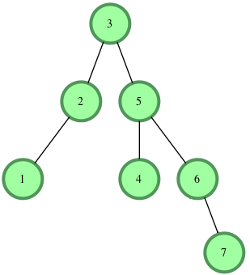

# Tree

## 2-3 tree

Self-balanced BST => O(log n) complexity

Either:
- 2-node: contains a single value and has two children
- 3-node: contains two values and has three children
- Leaf: 1 or 2 keys

Insert: find proper leaf and insert the value in-place. If the leaf has 3 values (called temporary 4-node), split the node into three 2-node and insert the middle value into the parent.

[#tree](tree.md)

## AVL tree

If tree is not balanced, rearange the nodes with single or double rotations

[#tree](tree.md)

## B-tree complexity: access, insert, delete

All: O(log n)

[#complexity](complexity.md) [#tree](tree.md)

## B-tree: definition and use case

Self-balanced BST => O(log n) complexity

Can have more than two children (generalization of 2-3 tree)

Use-case: huge amount of data that cannot fit in main memory but disk space.

Height is kept low to reduce the disk accesses.

Match how page disk are working

[#tree](tree.md)

## Balanced binary tree definition

The balance factor of each node (the difference between the two subtree heights) should never exceed 1

Guarantee of O(log n) search

[#tree](tree.md)

## Balanced BST use case: B-tree, Red-black tree, AVL tree

- B-tree: paging from disk (database)
- Red-black tree: fairly frequents inserts, deletes or retrievals
- AVL tree: many retrievals, infrequent inserts and deletes

[#tree](tree.md)

## BFS and DFS tree traversal time and space complexity

BFS: time O(v), space O(v)

DFS: time O(v), space O(h) (height of the tree)

[#complexity](complexity.md) [#tree](tree.md)

## Binary tree BFS traversal

Level order traversal (level by level)

Iterative algorithm: use a queue, put the root, iterate while queue is not empty

```java
Queue<Node> queue = new LinkedList<>();
queue.add(root);

while(!queue.isEmpty()) {
	Node node = queue.poll();
	visit(node);

	if(node.left != null) {
		queue.add(node.left);
	}
	if(node.right != null) {
		queue.add(node.right);
	}
}
```

[#tree](tree.md)

## Binary tree definition

Tree with each node having up to two children

[#tree](tree.md)

## Binary tree DFS traversal: in-order, pre-order and post-order

- In-order: left-root-right
- Pre-order: root-left-right
- Post-order: left-right-root

It's depth first so:



- In-order: 1, 2, 3, 4, 5, 6, 7
- Pre-order: 3, 2, 1, 5, 4, 6, 7
- Post-order: 1, 2, 4, 7, 6, 5, 3

[#tree](tree.md)

## Binary tree: complete

Every level of the tree is fully filled, with last level filled from the left to the right

[#tree](tree.md)

## Binary tree: full

Each node has 0 or 2 children

[#tree](tree.md)

## Binary tree: perfect

2^l - 1 nodes with l the level: 1, 3, 7, etc. nodes

Every level is fully filled

[#tree](tree.md)

## BST complexity: access, insert, delete

If not balanced O(n)

If balanced O(log n)

[#complexity](complexity.md) [#tree](tree.md)

## BST definition

Binary tree in which every node must fit the property: all left descendents <= n < all right descendents

Implementation: optional key, value, left, right

[#tree](tree.md)

## BST delete algo and complexity

Find inorder successor and swap it

Average: O(log n)

Worst: O(h) if not self-balanced BST, otherwise O(log n)

[#complexity](complexity.md) [#tree](tree.md)

## BST insert algo

Search for key or value (by recursively going left or right depending on the comparison) then insert a new node or reset the value (no swap)

Complexity: worst O(n)

```java
public TreeNode insert(TreeNode root, int a) {
	if (root == null) {
		return new TreeNode(a);
	}

	if (root.val <= a) { // Left
		root.left = insert(root.left, a);
	} else { // Right
		root.right = insert(root.right, a);
	}

	return root;
}
```

[#tree](tree.md)

## BST questions prerequisite

Is it a self-balanced BST? (impacts: O(log n) time complexity guarantee)

[#tree](tree.md)

## Complexity to create a trie

Time and space: O(n * l) with n the number of words and l the longest word length

[#complexity](complexity.md)

## Complexity to insert a key in a trie

Time: O(k) with k the size of the key

Space: O(1) iterative, O(k) recursive

[#complexity](complexity.md) [#tree](tree.md)

## Complexity to search for a key in a trie

Time: O(k) with k the size of the key

Space: O(1) iterative or O(k) recursive

[#complexity](complexity.md) [#tree](tree.md)

## Given a binary tree, algorithm to populate an array to represent its level-by-level traversal

Solution: BFS by popping only a fixed number of elements (queue.size)

```java
public static List<List<Integer>> traverse(TreeNode root) {
	List<List<Integer>> result = new LinkedList<>();
	Queue<TreeNode> queue = new LinkedList<>();
	queue.add(root);
	while (!queue.isEmpty()) {
		List<Integer> level = new ArrayList<>();
		
		int levelSize = queue.size();
		// Pop only levelSize elements
		for (int i = 0; i < levelSize; i++) {
			TreeNode current = queue.poll();
			level.add(current.val);
			if (current.left != null) {
				queue.add(current.left);
			}
			if (current.right != null) {
				queue.add(current.right);
			}
		}
		result.add(level);
	}
	return result;
}
```

[#tree](tree.md)

## How to calculate the path number of a node while traversing using DFS? 

Example: 1 -> 7 -> 3 gives 173

Solution: sum = sum * 10 + n

```java
private int dfs(TreeNode node, int sum) {
	if (node == null) {
		return 0;
	}

	sum = 10 * sum + node.val;

	// Do something
}
```

[#tree](tree.md)

## Min (or max) value in a BST

Move recursively on the left (on the right)

[#tree](tree.md)

## Red-Black tree

Self-balanced BST => O(log n) complexity

- Root node always black
- Incoming node is red
- Red violation: child and parent are red
- Resolve violation by recoloring and/or restructuring

### Further Reading

[Binary Trees: Red Black](https://towardsdatascience.com/red-black-binary-tree-maintaining-balance-e342f5aa6f5) by David Pynes

[#tree](tree.md)

## Red-black tree complexity: access, insert, delete

All: O(log n)

[#complexity](complexity.md) [#tree](tree.md)

## Reverse a binary tree algo

```java
public void reverse(Node node) {
	if (node == null) {
		return;
	}

	Node temp = node.right;
	node.right = node.left;
	node.left = temp;

	reverse(node.left);
	reverse(node.right);
}
```

[#tree](tree.md)

## Trie definition, implementation and use case

Tree-like data structure with empty root and where each node store characters

Each path down the tree represent a word (until a null node that represents the end of the word)

Usually implemented using a map of children (or a fixed size array with ASCII charset for example)

Use case: dictionnary (save memory)

Also known as prefix tree

[#tree](tree.md)

## Trie Implementation for characters
```java
class Trie {

    TrieNode head;

    public Trie(){
        this.head = new TrieNode('*');
    }
    
    public void insert(String word) {
        TrieNode curNode = head; 
        
        for(char c : word.toCharArray()){
            int index = c -'a';
            if(curNode.children[index] == null){
                curNode.children[index] = new TrieNode(c);
            }
            curNode = curNode.children[index];
        }
        curNode.isTerminal = true;

    }
    
    public boolean search(String word) {
        TrieNode curNode = head; 
        
        for(char c : word.toCharArray()){
            int index = c -'a';
            if(curNode.children[index] == null){
                return false;
            }
            curNode = curNode.children[index];
        }
        return curNode.isTerminal;   //check if this was a word
    }
    
    public boolean startsWith(String prefix) {
        TrieNode curNode = head; 
        
        for(char c : prefix.toCharArray()){
            int index = c -'a';
            if(curNode.children[index] == null){
                return false;
            }
            curNode = curNode.children[index];
        }
        return true;
    }

    class TrieNode{
        boolean isTerminal;
        char ch;
        TrieNode[] children;

        TrieNode(char ch){
            this.ch = ch;
            this.isTerminal = false;
            this.children = new TrieNode[26];  //as for our case the candidates are lowercase english letters only
        } 
    }
}
```
[#tree](tree.md)

## Trie Implementation with erasing

```java
class Trie_II {

    TrieNode head;
    public Trie_II() {
        head = new TrieNode('*');
    }

    public void insert(String word) {
        TrieNode cur = head;
        for(char c : word.toCharArray()){
            int index = c -'a';
            if(cur.children[index] == null){
                TrieNode newNode = new TrieNode(c);
                cur.children[index] = newNode;
            }
            cur.children[index].prefixCount += 1;
            cur = cur.children[index];
        }
        cur.wordCount += 1;
    }

    public int countWordsEqualTo(String word) {
        TrieNode cur = head;
        int count = 0;
        for(char c : word.toCharArray()){
            int index = c-'a';
            if(cur.children[index] == null){
                return 0;
            }
            cur = cur.children[index];
        }
        return cur.wordCount;
    }

    public int countWordsStartingWith(String prefix) {
        TrieNode cur = head;
        int count = 0;
        for(char c : prefix.toCharArray()){
            int index = c-'a';
            if(cur.children[index] == null){
                return 0;
            }
            cur = cur.children[index];
        }
        return cur.prefixCount;
    }

    public void erase(String word) {
        //It is guaranteed that for any function call to erase, the string word will exist in the trie.
        TrieNode cur = head;
        for(char c : word.toCharArray()){
            int index = c-'a';
            cur.children[index].prefixCount -= 1;
            cur = cur.children[index];
        }
        cur.wordCount -= 1;
    }

    class TrieNode{
        char val;
        TrieNode children[];
        int wordCount;
        int prefixCount;

        TrieNode(char val){
            this.val = val;
            this.wordCount = 0;
            this.prefixCount = 0;
            this.children = new TrieNode[26];
        }
    }
}
```
[#tree](tree.md)

## Segment Tree Implementation

```java
public class SegmentTree {

    // Segment tree data structure
    static int[] segmentTree;

    public SegmentTree(int n) {
        segmentTree = new int[4 * n + 1];
    }

    /**
     * Builds the segment tree recursively.
     *
     * @param stIndex The current index in the segment tree.
     * @param arr     The input array.
     * @param start   The start index of the current segment.
     * @param end     The end index of the current segment.
     */
    static void buildSegmentTree(int stIndex, int[] arr, int start, int end) {
        if (start == end) {
            // Leaf node
            segmentTree[stIndex] = arr[start];
            return;
        }

        int mid = start + (end - start) / 2;

        buildSegmentTree(2 * stIndex, arr, start, mid);
        buildSegmentTree(2 * stIndex + 1, arr, mid + 1, end);

        segmentTree[stIndex] = segmentTree[2 * stIndex] + segmentTree[2 * stIndex + 1];
    }

    /**
     * Performs a range query on the segment tree.
     *
     * @param queryStart The start of the query range.
     * @param queryEnd   The end of the query range.
     * @param stIndex    The current index in the segment tree.
     * @param start      The start index of the current segment.
     * @param end        The end index of the current segment.
     * @return The sum of elements in the specified range.
     */
    static int query(int queryStart, int queryEnd, int stIndex, int start, int end) {
        if (queryStart > end || queryEnd < start) {
            // No overlap with the current segment
            return 0;
        }

        if (start >= queryStart && end <= queryEnd) {
            // Total overlap with the current segment
            return segmentTree[stIndex];
        }

        int mid = start + (end - start) / 2;
        int leftSum = query(queryStart, queryEnd, 2 * stIndex, start, mid);
        int rightSum = query(queryStart, queryEnd, 2 * stIndex + 1, mid + 1, end);

        return leftSum + rightSum; // Partial overlap
    }

    /**
     * Updates an element in the input array and the corresponding node in the segment tree.
     *
     * @param stIndex   The current index in the segment tree.
     * @param start     The start index of the current segment.
     * @param end       The end index of the current segment.
     * @param position  The position of the element to update.
     * @param newValue  The new value for the element.
     */
    static void updateNode(int stIndex, int start, int end, int position, int newValue) {
        if (start == end) {
            // Total overlap (reached a leaf node)
            segmentTree[stIndex] = newValue;
            return;
        }
        int mid = start + (end - start) / 2;

        if (position <= mid) {
            // Update the left child if the position is in the left half
            updateNode(2 * stIndex, start, mid, position, newValue);
        } else {
            // Update the right child if the position is in the right half
            updateNode(2 * stIndex + 1, mid + 1, end, position, newValue);
        }

        segmentTree[stIndex] = segmentTree[2 * stIndex] + segmentTree[2 * stIndex + 1];
    }
}
```
[#tree](tree.md)

## Range Sum Mutable

```java
public class RangeSumMutable {

    int segTree[];
    int nums[];
    int stIndex;

    public RangeSumMutable(int[] nums) {
        int n = nums.length;
        this.nums = nums;
        System.out.println("n = "+n );
        segTree = new int[4*n+1];
        this.stIndex = 1;

        int start =0;
        int end = n-1;

        buildSegTree(stIndex, start, end);
    }

    private void buildSegTree(int stIndex, int start, int end){
        if(start > end)return;
        if(start == end){ //leafNode
            segTree[stIndex] = nums[start];
            return;
        }

        int mid = start + (end-start)/2;
        buildSegTree(2*stIndex, start, mid);
        buildSegTree(2*stIndex+1, mid+1, end);

        segTree[stIndex] = segTree[2*stIndex]+ segTree[2*stIndex+1];
    }

    public void update(int index, int val) {
        updateNode(index, val,0,nums.length-1, this.stIndex);
    }

    private void updateNode(int index, int newValue, int start, int end, int stIndex){
        if(start > index || end <index)return;
        if(start == end){ //total overlap
            segTree[stIndex] = newValue;
            return;
        }

        int mid = start + (end - start)/2;
        updateNode(index, newValue, start, mid, 2*stIndex);
        updateNode(index, newValue, mid+1, end, 2*stIndex+1);

        segTree[stIndex] = segTree[2*stIndex] + segTree[2*stIndex+1];
    }

    public int sumRange(int left, int right) {
        return sumRange(this.stIndex,0, nums.length-1, left, right);
    }

    private int sumRange(int stIndex,int start, int end, int qs, int qe){
        // no overlap
        if(qs> end || qe < start)return 0;

        //total overlap
        if(qs <= start && qe >= end){
            return segTree[stIndex];
        }

        int mid = start + (end -start) /2;
        int lSum = sumRange(2*stIndex, start, mid,qs,qe);
        int rSum = sumRange(2*stIndex +1 , mid+1, end, qs, qe);
        return lSum+ rSum;

    }
}

```
[#tree](tree.md)


## Find LCA of BST
```java
public class LCAofBinaryTree {
    public TreeNode lowestCommonAncestor(TreeNode root, TreeNode p, TreeNode q) {
        if (root == null) return null;
        if (p == null || root.val == q.val) return q;
        if (q == null || root.val == p.val) return p;


        TreeNode leftLCA = lowestCommonAncestor(root.left, p, q);
        TreeNode rightLCA = lowestCommonAncestor(root.right, p, q);

        if (leftLCA == null) return rightLCA;
        if (rightLCA == null) return leftLCA;
        return root;
    }
}
```
[#tree](tree.md)

## ZigZag Level Order Traversal implementation
```java
/**
 *   Its basically level order traversal with queue.
 * The only change is, for every alternate level, instead of storing node values in a list,
 * I first store them in a stack, which I later reverse into the list, so that every alternate level is shown as reverse;
 */
public class _8_ZigzagLevelOrderTraversal {
    public List<List<Integer>> zigzagLevelOrder(TreeNode root) {
        List<List<Integer>> result = new ArrayList<>();
        if(root== null) return result;
        Queue<TreeNode> q = new LinkedList<>();
        q.add(root);

        List<Integer> cur = new ArrayList<>();
        boolean oddLevel = true;

        while(!q.isEmpty()){
            int length = q.size();
            cur = new ArrayList<>();
            Stack<Integer> reverseStack = new Stack<>(); //for storage in alternate levels, even levels

            for(int i=0;i<length;i++){
                TreeNode node = q.remove();
                if(oddLevel){
                    cur.add(node.val);
                }
                else{
                    reverseStack.push(node.val);
                }
                if(node.left != null) q.add(node.left);
                if(node.right != null)q.add(node.right);
            }

            if(!oddLevel){
                while(!reverseStack.isEmpty()){
                    cur.add(reverseStack.pop());
                }
            }
            //chnage level flag
            oddLevel = !oddLevel;
            result.add(cur);
        }
        return result;
    }
}

```
[#tree](tree.md)

## Why to use BST over hash table

Sorted keys

[#tree](tree.md)
